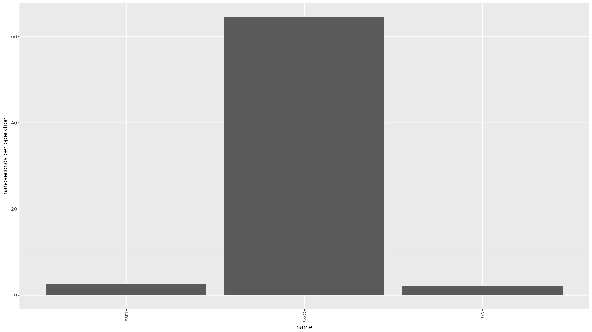

This directory includes function call overhead benchmarks.

# Setup
```
Ubuntu Linux
Intel(R) Xeon(R) CPU E5-2670 v2 @ 2.50GHz x 20 Cores (40 Hyperthreaded)
L1 Cache:   320 kB
L2 Cache:  2560 kB
L3 Cache: 25600 kB
Memory: 126 GB
```

This benchmark measures the overhead of making a function call to a function written in `ASM`, `CGO` and `Go`.

# Results
[](https://github.com/kellabyte/go-benchmarks/raw/master/results/calls.png)

```
make calls

goos: linux
goarch: amd64
pkg: github.com/kellabyte/go-benchmarks/calls
BenchmarkCGO-40    	20000000	        64.6 ns/op	  15.47 MB/s	       0 B/op	       0 allocs/op
BenchmarkGo-40     	1000000000	         2.23 ns/op	 447.64 MB/s	       0 B/op	       0 allocs/op
BenchmarkAsm-40    	500000000	         2.70 ns/op	 369.69 MB/s	       0 B/op	       0 allocs/op
PASS
ok  	github.com/kellabyte/go-benchmarks/calls	5.531s
```

# Credit
Special thanks to Egon Elbre for providing benchmarks. Original source was taken from [his repository](https://github.com/egonelbre/exp/tree/master/bench/call).