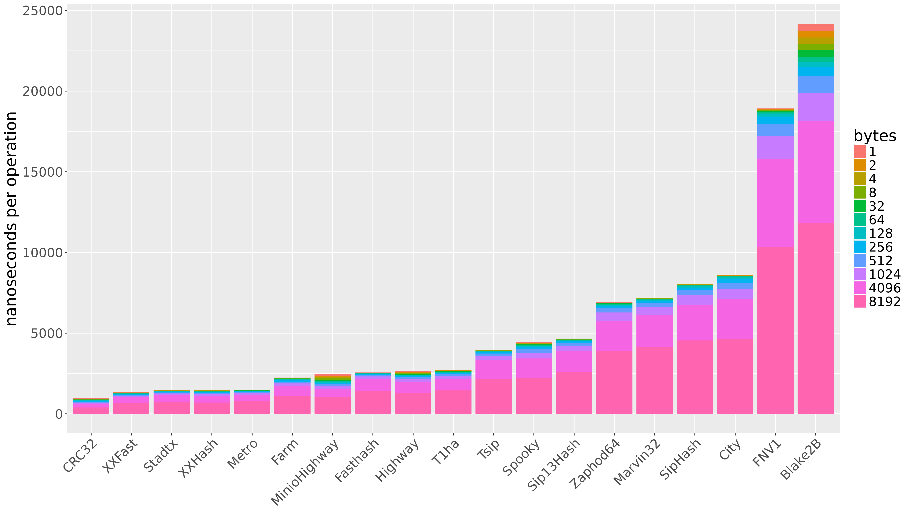
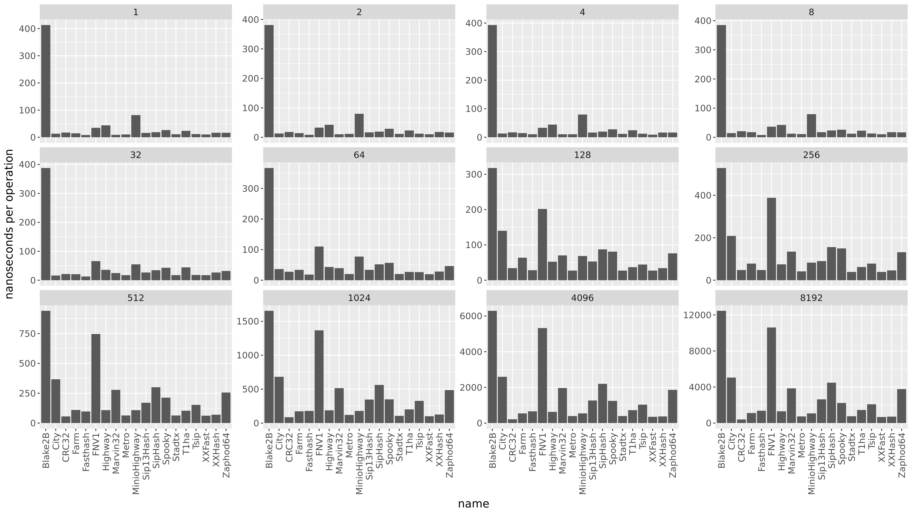

This directory includes hashing algorithm benchmarks. The majority of this code comes from [Damian Gryski (@dgryski)]( https://github.com/dgryski/trifles/tree/master/hashbench) with some additions from myself.

# Setup
```
Ubuntu Linux
Intel(R) Xeon(R) CPU E5-2670 v2 @ 2.50GHz x 20 Cores (40 Hyperthreaded)
L1 Cache:   320 kB
L2 Cache:  2560 kB
L3 Cache: 25600 kB
Memory: 126 GB
```

# Results
[](https://github.com/kellabyte/go-benchmarks/raw/master/results/hashing-histogram.png)
[](https://github.com/kellabyte/go-benchmarks/raw/master/results/hashing-multi.png)
```

make hashing

goos: linux
goarch: amd64
pkg: github.com/kellabyte/go-benchmarks/hashing
BenchmarkBlake2B/1-40       	 3000000	       432 ns/op	   2.31 MB/s	       0 B/op	       0 allocs/op
BenchmarkBlake2B/2-40       	 3000000	       404 ns/op	   4.95 MB/s	       0 B/op	       0 allocs/op
BenchmarkBlake2B/4-40       	 3000000	       402 ns/op	   9.94 MB/s	       0 B/op	       0 allocs/op
BenchmarkBlake2B/8-40       	 3000000	       397 ns/op	  20.13 MB/s	       0 B/op	       0 allocs/op
BenchmarkBlake2B/32-40      	 3000000	       384 ns/op	  83.33 MB/s	       0 B/op	       0 allocs/op
BenchmarkBlake2B/64-40      	 5000000	       337 ns/op	 189.87 MB/s	       0 B/op	       0 allocs/op
BenchmarkBlake2B/128-40     	 5000000	       303 ns/op	 422.35 MB/s	       0 B/op	       0 allocs/op
BenchmarkBlake2B/256-40     	 3000000	       508 ns/op	 503.54 MB/s	       0 B/op	       0 allocs/op
BenchmarkBlake2B/512-40     	 2000000	       989 ns/op	 517.55 MB/s	       0 B/op	       0 allocs/op
BenchmarkBlake2B/1024-40    	 1000000	      1660 ns/op	 616.83 MB/s	       0 B/op	       0 allocs/op
BenchmarkBlake2B/4096-40    	  200000	      6195 ns/op	 661.11 MB/s	       0 B/op	       0 allocs/op
BenchmarkBlake2B/8192-40    	  100000	     12368 ns/op	 662.31 MB/s	       0 B/op	       0 allocs/op
BenchmarkCRC32/1-40         	100000000	        17.1 ns/op	  58.36 MB/s	       0 B/op	       0 allocs/op
BenchmarkCRC32/2-40         	100000000	        17.0 ns/op	 117.42 MB/s	       0 B/op	       0 allocs/op
BenchmarkCRC32/4-40         	100000000	        17.2 ns/op	 233.15 MB/s	       0 B/op	       0 allocs/op
BenchmarkCRC32/8-40         	100000000	        19.0 ns/op	 421.71 MB/s	       0 B/op	       0 allocs/op
BenchmarkCRC32/32-40        	100000000	        21.6 ns/op	1478.41 MB/s	       0 B/op	       0 allocs/op
BenchmarkCRC32/64-40        	50000000	        25.9 ns/op	2474.45 MB/s	       0 B/op	       0 allocs/op
BenchmarkCRC32/128-40       	50000000	        33.5 ns/op	3817.90 MB/s	       0 B/op	       0 allocs/op
BenchmarkCRC32/256-40       	20000000	        51.9 ns/op	4935.75 MB/s	       0 B/op	       0 allocs/op
BenchmarkCRC32/512-40       	30000000	        55.6 ns/op	9216.87 MB/s	       0 B/op	       0 allocs/op
BenchmarkCRC32/1024-40      	20000000	        85.8 ns/op	11940.24 MB/s	       0 B/op	       0 allocs/op
BenchmarkCRC32/4096-40      	10000000	       206 ns/op	19804.58 MB/s	       0 B/op	       0 allocs/op
BenchmarkCRC32/8192-40      	 3000000	       406 ns/op	20158.52 MB/s	       0 B/op	       0 allocs/op
BenchmarkSpooky/1-40        	50000000	        26.6 ns/op	  37.62 MB/s	       0 B/op	       0 allocs/op
BenchmarkSpooky/2-40        	50000000	        28.1 ns/op	  71.13 MB/s	       0 B/op	       0 allocs/op
BenchmarkSpooky/4-40        	50000000	        27.0 ns/op	 148.01 MB/s	       0 B/op	       0 allocs/op
BenchmarkSpooky/8-40        	50000000	        27.0 ns/op	 295.82 MB/s	       0 B/op	       0 allocs/op
BenchmarkSpooky/32-40       	30000000	        42.4 ns/op	 754.19 MB/s	       0 B/op	       0 allocs/op
BenchmarkSpooky/64-40       	20000000	        56.1 ns/op	1140.23 MB/s	       0 B/op	       0 allocs/op
BenchmarkSpooky/128-40      	20000000	        80.0 ns/op	1599.27 MB/s	       0 B/op	       0 allocs/op
BenchmarkSpooky/256-40      	10000000	       149 ns/op	1709.96 MB/s	       0 B/op	       0 allocs/op
BenchmarkSpooky/512-40      	10000000	       207 ns/op	2464.92 MB/s	       0 B/op	       0 allocs/op
BenchmarkSpooky/1024-40     	 5000000	       354 ns/op	2892.52 MB/s	       0 B/op	       0 allocs/op
BenchmarkSpooky/4096-40     	 1000000	      1213 ns/op	3374.31 MB/s	       0 B/op	       0 allocs/op
BenchmarkSpooky/8192-40     	  500000	      2311 ns/op	3544.44 MB/s	       0 B/op	       0 allocs/op
BenchmarkSipHash/1-40       	100000000	        18.8 ns/op	  53.30 MB/s	       0 B/op	       0 allocs/op
BenchmarkSipHash/2-40       	100000000	        19.9 ns/op	 100.30 MB/s	       0 B/op	       0 allocs/op
BenchmarkSipHash/4-40       	100000000	        19.9 ns/op	 200.94 MB/s	       0 B/op	       0 allocs/op
BenchmarkSipHash/8-40       	50000000	        24.8 ns/op	 322.41 MB/s	       0 B/op	       0 allocs/op
BenchmarkSipHash/32-40      	50000000	        35.1 ns/op	 910.46 MB/s	       0 B/op	       0 allocs/op
BenchmarkSipHash/64-40      	30000000	        53.5 ns/op	1195.72 MB/s	       0 B/op	       0 allocs/op
BenchmarkSipHash/128-40     	20000000	        89.7 ns/op	1427.52 MB/s	       0 B/op	       0 allocs/op
BenchmarkSipHash/256-40     	10000000	       159 ns/op	1601.99 MB/s	       0 B/op	       0 allocs/op
BenchmarkSipHash/512-40     	 5000000	       302 ns/op	1690.39 MB/s	       0 B/op	       0 allocs/op
BenchmarkSipHash/1024-40    	 3000000	       580 ns/op	1762.49 MB/s	       0 B/op	       0 allocs/op
BenchmarkSipHash/4096-40    	 1000000	      2237 ns/op	1830.93 MB/s	       0 B/op	       0 allocs/op
BenchmarkSipHash/8192-40    	  300000	      4565 ns/op	1794.19 MB/s	       0 B/op	       0 allocs/op
BenchmarkFarm/1-40          	100000000	        14.6 ns/op	  68.64 MB/s	       0 B/op	       0 allocs/op
BenchmarkFarm/2-40          	100000000	        14.3 ns/op	 139.98 MB/s	       0 B/op	       0 allocs/op
BenchmarkFarm/4-40          	100000000	        14.9 ns/op	 268.36 MB/s	       0 B/op	       0 allocs/op
BenchmarkFarm/8-40          	100000000	        17.1 ns/op	 467.38 MB/s	       0 B/op	       0 allocs/op
BenchmarkFarm/32-40         	100000000	        21.4 ns/op	1493.63 MB/s	       0 B/op	       0 allocs/op
BenchmarkFarm/64-40         	50000000	        34.5 ns/op	1855.79 MB/s	       0 B/op	       0 allocs/op
BenchmarkFarm/128-40        	20000000	        64.0 ns/op	2001.37 MB/s	       0 B/op	       0 allocs/op
BenchmarkFarm/256-40        	20000000	        80.8 ns/op	3169.09 MB/s	       0 B/op	       0 allocs/op
BenchmarkFarm/512-40        	20000000	       110 ns/op	4620.44 MB/s	       0 B/op	       0 allocs/op
BenchmarkFarm/1024-40       	10000000	       179 ns/op	5705.00 MB/s	       0 B/op	       0 allocs/op
BenchmarkFarm/4096-40       	 2000000	       560 ns/op	7305.63 MB/s	       0 B/op	       0 allocs/op
BenchmarkFarm/8192-40       	 1000000	      1184 ns/op	6915.42 MB/s	       0 B/op	       0 allocs/op
BenchmarkCity/1-40          	100000000	        12.7 ns/op	  78.62 MB/s	       0 B/op	       0 allocs/op
BenchmarkCity/2-40          	100000000	        21.8 ns/op	  91.79 MB/s	       0 B/op	       0 allocs/op
BenchmarkCity/4-40          	100000000	        12.9 ns/op	 309.69 MB/s	       0 B/op	       0 allocs/op
BenchmarkCity/8-40          	100000000	        13.8 ns/op	 580.08 MB/s	       0 B/op	       0 allocs/op
BenchmarkCity/32-40         	100000000	        15.5 ns/op	2069.93 MB/s	       0 B/op	       0 allocs/op
BenchmarkCity/64-40         	50000000	        33.1 ns/op	1931.42 MB/s	       0 B/op	       0 allocs/op
BenchmarkCity/128-40        	10000000	       145 ns/op	 882.55 MB/s	       0 B/op	       0 allocs/op
BenchmarkCity/256-40        	10000000	       213 ns/op	1198.66 MB/s	       0 B/op	       0 allocs/op
BenchmarkCity/512-40        	 5000000	       351 ns/op	1454.86 MB/s	       0 B/op	       0 allocs/op
BenchmarkCity/1024-40       	 2000000	       683 ns/op	1498.08 MB/s	       0 B/op	       0 allocs/op
BenchmarkCity/4096-40       	  500000	      2609 ns/op	1569.54 MB/s	       0 B/op	       0 allocs/op
BenchmarkCity/8192-40       	  300000	      4765 ns/op	1719.14 MB/s	       0 B/op	       0 allocs/op
BenchmarkMetro/1-40         	100000000	        10.8 ns/op	  92.65 MB/s	       0 B/op	       0 allocs/op
BenchmarkMetro/2-40         	100000000	        11.0 ns/op	 181.82 MB/s	       0 B/op	       0 allocs/op
BenchmarkMetro/4-40         	100000000	        10.4 ns/op	 382.91 MB/s	       0 B/op	       0 allocs/op
BenchmarkMetro/8-40         	100000000	        10.3 ns/op	 773.32 MB/s	       0 B/op	       0 allocs/op
BenchmarkMetro/32-40        	100000000	        16.6 ns/op	1926.98 MB/s	       0 B/op	       0 allocs/op
BenchmarkMetro/64-40        	100000000	        20.1 ns/op	3178.85 MB/s	       0 B/op	       0 allocs/op
BenchmarkMetro/128-40       	50000000	        28.0 ns/op	4569.29 MB/s	       0 B/op	       0 allocs/op
BenchmarkMetro/256-40       	30000000	        40.9 ns/op	6251.65 MB/s	       0 B/op	       0 allocs/op
BenchmarkMetro/512-40       	20000000	        64.3 ns/op	7968.50 MB/s	       0 B/op	       0 allocs/op
BenchmarkMetro/1024-40      	10000000	       118 ns/op	8615.76 MB/s	       0 B/op	       0 allocs/op
BenchmarkMetro/4096-40      	 3000000	       367 ns/op	11152.36 MB/s	       0 B/op	       0 allocs/op
BenchmarkMetro/8192-40      	 2000000	       717 ns/op	11413.84 MB/s	       0 B/op	       0 allocs/op
BenchmarkXXHash/1-40        	100000000	        26.2 ns/op	  38.11 MB/s	       0 B/op	       0 allocs/op
BenchmarkXXHash/2-40        	100000000	        18.2 ns/op	 109.61 MB/s	       0 B/op	       0 allocs/op
BenchmarkXXHash/4-40        	100000000	        16.9 ns/op	 236.62 MB/s	       0 B/op	       0 allocs/op
BenchmarkXXHash/8-40        	100000000	        17.8 ns/op	 449.47 MB/s	       0 B/op	       0 allocs/op
BenchmarkXXHash/32-40       	50000000	        26.8 ns/op	1194.42 MB/s	       0 B/op	       0 allocs/op
BenchmarkXXHash/64-40       	50000000	        28.3 ns/op	2260.40 MB/s	       0 B/op	       0 allocs/op
BenchmarkXXHash/128-40      	50000000	        34.6 ns/op	3698.82 MB/s	       0 B/op	       0 allocs/op
BenchmarkXXHash/256-40      	30000000	        48.7 ns/op	5253.41 MB/s	       0 B/op	       0 allocs/op
BenchmarkXXHash/512-40      	20000000	        71.3 ns/op	7185.10 MB/s	       0 B/op	       0 allocs/op
BenchmarkXXHash/1024-40     	10000000	       123 ns/op	8310.38 MB/s	       0 B/op	       0 allocs/op
BenchmarkXXHash/4096-40     	 3000000	       383 ns/op	10687.60 MB/s	       0 B/op	       0 allocs/op
BenchmarkXXHash/8192-40     	 2000000	      1410 ns/op	5806.01 MB/s	       0 B/op	       0 allocs/op
BenchmarkXXFast/1-40        	200000000	         8.84 ns/op	 113.10 MB/s	       0 B/op	       0 allocs/op
BenchmarkXXFast/2-40        	100000000	        10.9 ns/op	 183.18 MB/s	       0 B/op	       0 allocs/op
BenchmarkXXFast/4-40        	200000000	         9.00 ns/op	 444.52 MB/s	       0 B/op	       0 allocs/op
BenchmarkXXFast/8-40        	100000000	        10.4 ns/op	 770.04 MB/s	       0 B/op	       0 allocs/op
BenchmarkXXFast/32-40       	100000000	        17.1 ns/op	1871.43 MB/s	       0 B/op	       0 allocs/op
BenchmarkXXFast/64-40       	100000000	        21.3 ns/op	3009.02 MB/s	       0 B/op	       0 allocs/op
BenchmarkXXFast/128-40      	50000000	        26.4 ns/op	4848.22 MB/s	       0 B/op	       0 allocs/op
BenchmarkXXFast/256-40      	30000000	        41.2 ns/op	6211.41 MB/s	       0 B/op	       0 allocs/op
BenchmarkXXFast/512-40      	20000000	        61.8 ns/op	8278.66 MB/s	       0 B/op	       0 allocs/op
BenchmarkXXFast/1024-40     	20000000	       108 ns/op	9426.90 MB/s	       0 B/op	       0 allocs/op
BenchmarkXXFast/4096-40     	 3000000	       360 ns/op	11368.22 MB/s	       0 B/op	       0 allocs/op
BenchmarkXXFast/8192-40     	 2000000	       694 ns/op	11793.99 MB/s	       0 B/op	       0 allocs/op
BenchmarkFasthash/1-40      	200000000	         8.70 ns/op	 115.00 MB/s	       0 B/op	       0 allocs/op
BenchmarkFasthash/2-40      	100000000	        10.2 ns/op	 196.27 MB/s	       0 B/op	       0 allocs/op
BenchmarkFasthash/4-40      	100000000	        10.7 ns/op	 374.26 MB/s	       0 B/op	       0 allocs/op
BenchmarkFasthash/8-40      	200000000	         8.34 ns/op	 959.39 MB/s	       0 B/op	       0 allocs/op
BenchmarkFasthash/32-40     	100000000	        12.6 ns/op	2547.16 MB/s	       0 B/op	       0 allocs/op
BenchmarkFasthash/64-40     	100000000	        17.4 ns/op	3668.86 MB/s	       0 B/op	       0 allocs/op
BenchmarkFasthash/128-40    	50000000	        29.2 ns/op	4383.09 MB/s	       0 B/op	       0 allocs/op
BenchmarkFasthash/256-40    	30000000	        50.5 ns/op	5067.97 MB/s	       0 B/op	       0 allocs/op
BenchmarkFasthash/512-40    	20000000	        97.8 ns/op	5236.04 MB/s	       0 B/op	       0 allocs/op
BenchmarkFasthash/1024-40   	10000000	       182 ns/op	5603.64 MB/s	       0 B/op	       0 allocs/op
BenchmarkFasthash/4096-40   	 2000000	       737 ns/op	5554.83 MB/s	       0 B/op	       0 allocs/op
BenchmarkFasthash/8192-40   	 1000000	      1404 ns/op	5832.26 MB/s	       0 B/op	       0 allocs/op
BenchmarkHighway/1-40       	30000000	        43.8 ns/op	  22.84 MB/s	       0 B/op	       0 allocs/op
BenchmarkHighway/2-40       	30000000	        44.8 ns/op	  44.64 MB/s	       0 B/op	       0 allocs/op
BenchmarkHighway/4-40       	30000000	        43.9 ns/op	  91.17 MB/s	       0 B/op	       0 allocs/op
BenchmarkHighway/8-40       	30000000	        42.1 ns/op	 190.10 MB/s	       0 B/op	       0 allocs/op
BenchmarkHighway/32-40      	50000000	        38.2 ns/op	 837.09 MB/s	       0 B/op	       0 allocs/op
BenchmarkHighway/64-40      	30000000	        44.1 ns/op	1449.86 MB/s	       0 B/op	       0 allocs/op
BenchmarkHighway/128-40     	30000000	        53.5 ns/op	2391.34 MB/s	       0 B/op	       0 allocs/op
BenchmarkHighway/256-40     	20000000	        72.0 ns/op	3555.82 MB/s	       0 B/op	       0 allocs/op
BenchmarkHighway/512-40     	20000000	       106 ns/op	4798.60 MB/s	       0 B/op	       0 allocs/op
BenchmarkHighway/1024-40    	10000000	       185 ns/op	5529.40 MB/s	       0 B/op	       0 allocs/op
BenchmarkHighway/4096-40    	 2000000	       640 ns/op	6393.10 MB/s	       0 B/op	       0 allocs/op
BenchmarkHighway/8192-40    	 1000000	      1237 ns/op	6621.30 MB/s	       0 B/op	       0 allocs/op
BenchmarkMinioHighway/1-40  	20000000	        82.1 ns/op	  12.18 MB/s	       0 B/op	       0 allocs/op
BenchmarkMinioHighway/2-40  	20000000	        76.7 ns/op	  26.07 MB/s	       0 B/op	       0 allocs/op
BenchmarkMinioHighway/4-40  	20000000	        78.0 ns/op	  51.26 MB/s	       0 B/op	       0 allocs/op
BenchmarkMinioHighway/8-40  	20000000	        81.0 ns/op	  98.74 MB/s	       0 B/op	       0 allocs/op
BenchmarkMinioHighway/32-40 	20000000	        56.0 ns/op	 571.56 MB/s	       0 B/op	       0 allocs/op
BenchmarkMinioHighway/64-40 	20000000	        60.3 ns/op	1061.49 MB/s	       0 B/op	       0 allocs/op
BenchmarkMinioHighway/128-40         	20000000	        67.6 ns/op	1892.81 MB/s	       0 B/op	       0 allocs/op
BenchmarkMinioHighway/256-40         	20000000	        81.9 ns/op	3127.35 MB/s	       0 B/op	       0 allocs/op
BenchmarkMinioHighway/512-40         	20000000	       110 ns/op	4618.04 MB/s	       0 B/op	       0 allocs/op
BenchmarkMinioHighway/1024-40        	10000000	       168 ns/op	6059.25 MB/s	       0 B/op	       0 allocs/op
BenchmarkMinioHighway/4096-40        	 2000000	       551 ns/op	7431.68 MB/s	       0 B/op	       0 allocs/op
BenchmarkMinioHighway/8192-40        	 2000000	      1002 ns/op	8167.70 MB/s	       0 B/op	       0 allocs/op
BenchmarkMarvin32/1-40               	200000000	         8.77 ns/op	 114.02 MB/s	       0 B/op	       0 allocs/op
BenchmarkMarvin32/2-40               	100000000	        10.1 ns/op	 197.40 MB/s	       0 B/op	       0 allocs/op
BenchmarkMarvin32/4-40               	100000000	        10.9 ns/op	 367.15 MB/s	       0 B/op	       0 allocs/op
BenchmarkMarvin32/8-40               	100000000	        12.1 ns/op	 662.28 MB/s	       0 B/op	       0 allocs/op
BenchmarkMarvin32/32-40              	50000000	        23.4 ns/op	1366.20 MB/s	       0 B/op	       0 allocs/op
BenchmarkMarvin32/64-40              	30000000	        41.4 ns/op	1546.61 MB/s	       0 B/op	       0 allocs/op
BenchmarkMarvin32/128-40             	20000000	        70.7 ns/op	1810.33 MB/s	       0 B/op	       0 allocs/op
BenchmarkMarvin32/256-40             	10000000	       129 ns/op	1970.16 MB/s	       0 B/op	       0 allocs/op
BenchmarkMarvin32/512-40             	 5000000	       261 ns/op	1960.62 MB/s	       0 B/op	       0 allocs/op
BenchmarkMarvin32/1024-40            	 3000000	       506 ns/op	2020.95 MB/s	       0 B/op	       0 allocs/op
BenchmarkMarvin32/4096-40            	 1000000	      1981 ns/op	2066.65 MB/s	       0 B/op	       0 allocs/op
BenchmarkMarvin32/8192-40            	  300000	      4108 ns/op	1993.82 MB/s	       0 B/op	       0 allocs/op
BenchmarkSip13Hash/1-40              	100000000	        14.6 ns/op	  68.42 MB/s	       0 B/op	       0 allocs/op
BenchmarkSip13Hash/2-40              	100000000	        15.6 ns/op	 128.26 MB/s	       0 B/op	       0 allocs/op
BenchmarkSip13Hash/4-40              	100000000	        16.6 ns/op	 240.55 MB/s	       0 B/op	       0 allocs/op
BenchmarkSip13Hash/8-40              	100000000	        18.0 ns/op	 443.79 MB/s	       0 B/op	       0 allocs/op
BenchmarkSip13Hash/32-40             	50000000	        25.9 ns/op	1237.18 MB/s	       0 B/op	       0 allocs/op
BenchmarkSip13Hash/64-40             	50000000	        32.9 ns/op	1944.82 MB/s	       0 B/op	       0 allocs/op
BenchmarkSip13Hash/128-40            	30000000	        52.7 ns/op	2427.80 MB/s	       0 B/op	       0 allocs/op
BenchmarkSip13Hash/256-40            	20000000	        92.7 ns/op	2761.65 MB/s	       0 B/op	       0 allocs/op
BenchmarkSip13Hash/512-40            	10000000	       196 ns/op	2601.43 MB/s	       0 B/op	       0 allocs/op
BenchmarkSip13Hash/1024-40           	 5000000	       466 ns/op	2193.41 MB/s	       0 B/op	       0 allocs/op
BenchmarkSip13Hash/4096-40           	 1000000	      1189 ns/op	3444.00 MB/s	       0 B/op	       0 allocs/op
BenchmarkSip13Hash/8192-40           	  500000	      2542 ns/op	3221.56 MB/s	       0 B/op	       0 allocs/op
BenchmarkFNV1/1-40                   	50000000	        32.0 ns/op	  31.24 MB/s	       8 B/op	       1 allocs/op
BenchmarkFNV1/2-40                   	50000000	        33.4 ns/op	  59.79 MB/s	       8 B/op	       1 allocs/op
BenchmarkFNV1/4-40                   	50000000	        33.1 ns/op	 120.92 MB/s	       8 B/op	       1 allocs/op
BenchmarkFNV1/8-40                   	50000000	        35.6 ns/op	 224.76 MB/s	       8 B/op	       1 allocs/op
BenchmarkFNV1/32-40                  	20000000	        68.2 ns/op	 469.43 MB/s	       8 B/op	       1 allocs/op
BenchmarkFNV1/64-40                  	20000000	       110 ns/op	 581.02 MB/s	       8 B/op	       1 allocs/op
BenchmarkFNV1/128-40                 	10000000	       208 ns/op	 612.65 MB/s	       8 B/op	       1 allocs/op
BenchmarkFNV1/256-40                 	 5000000	       388 ns/op	 659.64 MB/s	       8 B/op	       1 allocs/op
BenchmarkFNV1/512-40                 	 2000000	       725 ns/op	 706.18 MB/s	       8 B/op	       1 allocs/op
BenchmarkFNV1/1024-40                	 1000000	      1405 ns/op	 728.41 MB/s	       8 B/op	       1 allocs/op
BenchmarkFNV1/4096-40                	  200000	      5181 ns/op	 790.51 MB/s	       8 B/op	       1 allocs/op
BenchmarkFNV1/8192-40                	  200000	     10554 ns/op	 776.18 MB/s	       8 B/op	       1 allocs/op
BenchmarkT1ha/1-40                   	50000000	        22.9 ns/op	  43.59 MB/s	       0 B/op	       0 allocs/op
BenchmarkT1ha/2-40                   	50000000	        23.6 ns/op	  84.62 MB/s	       0 B/op	       0 allocs/op
BenchmarkT1ha/4-40                   	50000000	        23.4 ns/op	 170.69 MB/s	       0 B/op	       0 allocs/op
BenchmarkT1ha/8-40                   	50000000	        23.9 ns/op	 334.82 MB/s	       0 B/op	       0 allocs/op
BenchmarkT1ha/32-40                  	30000000	        41.9 ns/op	 763.55 MB/s	       0 B/op	       0 allocs/op
BenchmarkT1ha/64-40                  	50000000	        26.0 ns/op	2461.05 MB/s	       0 B/op	       0 allocs/op
BenchmarkT1ha/128-40                 	30000000	        38.8 ns/op	3300.28 MB/s	       0 B/op	       0 allocs/op
BenchmarkT1ha/256-40                 	20000000	        58.8 ns/op	4355.53 MB/s	       0 B/op	       0 allocs/op
BenchmarkT1ha/512-40                 	20000000	       103 ns/op	4946.42 MB/s	       0 B/op	       0 allocs/op
BenchmarkT1ha/1024-40                	10000000	       193 ns/op	5281.40 MB/s	       0 B/op	       0 allocs/op
BenchmarkT1ha/4096-40                	 2000000	       696 ns/op	5880.08 MB/s	       0 B/op	       0 allocs/op
BenchmarkT1ha/8192-40                	 1000000	      1409 ns/op	5811.66 MB/s	       0 B/op	       0 allocs/op
BenchmarkZaphod64/1-40               	100000000	        17.2 ns/op	  58.25 MB/s	       0 B/op	       0 allocs/op
BenchmarkZaphod64/2-40               	100000000	        18.2 ns/op	 110.06 MB/s	       0 B/op	       0 allocs/op
BenchmarkZaphod64/4-40               	100000000	        17.1 ns/op	 234.22 MB/s	       0 B/op	       0 allocs/op
BenchmarkZaphod64/8-40               	100000000	        17.3 ns/op	 461.46 MB/s	       0 B/op	       0 allocs/op
BenchmarkZaphod64/32-40              	50000000	        31.8 ns/op	1006.25 MB/s	       0 B/op	       0 allocs/op
BenchmarkZaphod64/64-40              	30000000	        47.4 ns/op	1351.04 MB/s	       0 B/op	       0 allocs/op
BenchmarkZaphod64/128-40             	20000000	        73.4 ns/op	1742.76 MB/s	       0 B/op	       0 allocs/op
BenchmarkZaphod64/256-40             	10000000	       138 ns/op	1853.48 MB/s	       0 B/op	       0 allocs/op
BenchmarkZaphod64/512-40             	 5000000	       283 ns/op	1807.21 MB/s	       0 B/op	       0 allocs/op
BenchmarkZaphod64/1024-40            	 3000000	       800 ns/op	1278.87 MB/s	       0 B/op	       0 allocs/op
BenchmarkZaphod64/4096-40            	 1000000	      1862 ns/op	2198.98 MB/s	       0 B/op	       0 allocs/op
BenchmarkZaphod64/8192-40            	  300000	      3909 ns/op	2095.40 MB/s	       0 B/op	       0 allocs/op
BenchmarkStadtx/1-40                 	100000000	        12.4 ns/op	  80.77 MB/s	       0 B/op	       0 allocs/op
BenchmarkStadtx/2-40                 	100000000	        11.3 ns/op	 177.13 MB/s	       0 B/op	       0 allocs/op
BenchmarkStadtx/4-40                 	100000000	        11.9 ns/op	 335.28 MB/s	       0 B/op	       0 allocs/op
BenchmarkStadtx/8-40                 	100000000	        12.8 ns/op	 623.57 MB/s	       0 B/op	       0 allocs/op
BenchmarkStadtx/32-40                	100000000	        17.3 ns/op	1846.74 MB/s	       0 B/op	       0 allocs/op
BenchmarkStadtx/64-40                	100000000	        20.1 ns/op	3186.10 MB/s	       0 B/op	       0 allocs/op
BenchmarkStadtx/128-40               	50000000	        39.9 ns/op	3207.58 MB/s	       0 B/op	       0 allocs/op
BenchmarkStadtx/256-40               	30000000	        39.1 ns/op	6543.57 MB/s	       0 B/op	       0 allocs/op
BenchmarkStadtx/512-40               	20000000	        63.8 ns/op	8019.79 MB/s	       0 B/op	       0 allocs/op
BenchmarkStadtx/1024-40              	10000000	       113 ns/op	9041.50 MB/s	       0 B/op	       0 allocs/op
BenchmarkStadtx/4096-40              	 3000000	       381 ns/op	10728.96 MB/s	       0 B/op	       0 allocs/op
BenchmarkStadtx/8192-40              	 2000000	       724 ns/op	11310.24 MB/s	       0 B/op	       0 allocs/op
BenchmarkTsip/1-40                   	100000000	        12.0 ns/op	  83.13 MB/s	       0 B/op	       0 allocs/op
BenchmarkTsip/2-40                   	100000000	        12.5 ns/op	 159.66 MB/s	       0 B/op	       0 allocs/op
BenchmarkTsip/4-40                   	100000000	        12.7 ns/op	 314.24 MB/s	       0 B/op	       0 allocs/op
BenchmarkTsip/8-40                   	100000000	        13.6 ns/op	 589.51 MB/s	       0 B/op	       0 allocs/op
BenchmarkTsip/32-40                  	100000000	        18.8 ns/op	1701.80 MB/s	       0 B/op	       0 allocs/op
BenchmarkTsip/64-40                  	50000000	        27.2 ns/op	2351.30 MB/s	       0 B/op	       0 allocs/op
BenchmarkTsip/128-40                 	30000000	        44.4 ns/op	2879.73 MB/s	       0 B/op	       0 allocs/op
BenchmarkTsip/256-40                 	20000000	        78.3 ns/op	3271.46 MB/s	       0 B/op	       0 allocs/op
BenchmarkTsip/512-40                 	10000000	       145 ns/op	3514.80 MB/s	       0 B/op	       0 allocs/op
BenchmarkTsip/1024-40                	 5000000	       277 ns/op	3690.44 MB/s	       0 B/op	       0 allocs/op
BenchmarkTsip/4096-40                	 1000000	      1044 ns/op	3920.20 MB/s	       0 B/op	       0 allocs/op
BenchmarkTsip/8192-40                	 1000000	      2154 ns/op	3801.60 MB/s	       0 B/op	       0 allocs/op
PASS
ok  	github.com/kellabyte/go-benchmarks/hashing	402.919s
```