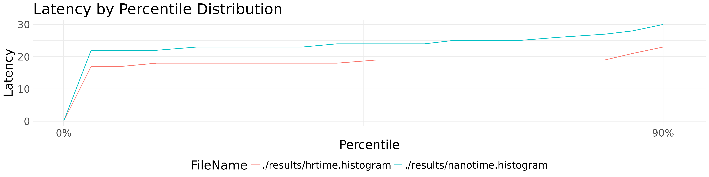
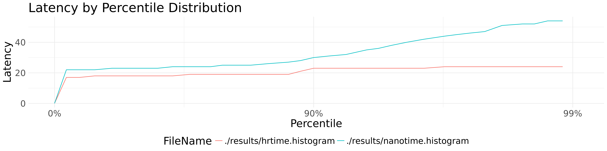
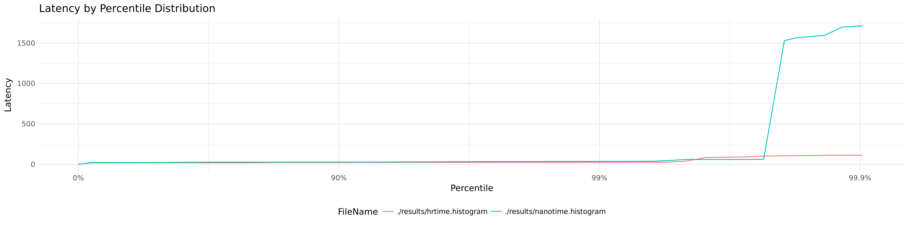
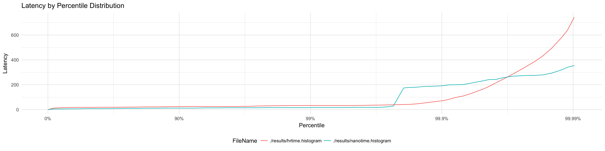
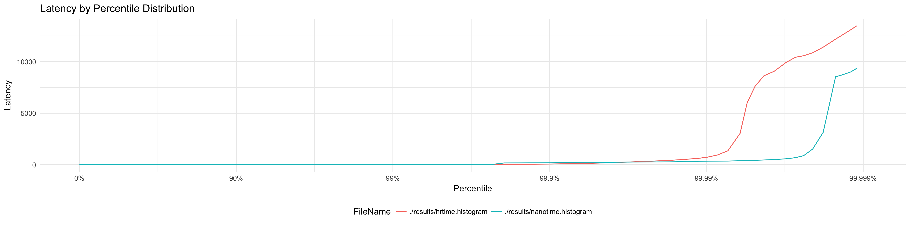
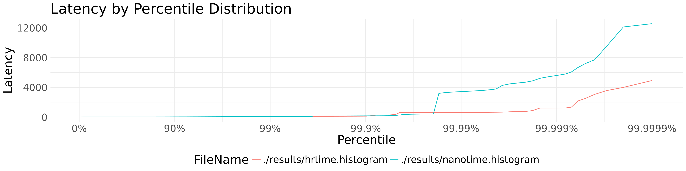

# Introduction
This directory includes queue implementation benchmarks for various different time stamp functions.

# Guarantees
Different time functions have different tradeoffs. 

### Staleness
_TODO_

# Setup
```
Ubuntu Linux
Intel(R) Xeon(R) CPU E5-2670 v2 @ 2.50GHz x 20 Cores (40 Hyperthreaded)
L1 Cache:   320 kB
L2 Cache:  2560 kB
L3 Cache: 25600 kB
Memory: 126 GB
```

# Results
[](https://github.com/kellabyte/go-benchmarks/raw/master/results/time.png)

### p90
[](https://github.com/kellabyte/go-benchmarks/raw/master/results/time_p90.png)
### p99
[](https://github.com/kellabyte/go-benchmarks/raw/master/results/time_p99.png)
### p999
[](https://github.com/kellabyte/go-benchmarks/raw/master/results/time_p999.png)
### p9999
[](https://github.com/kellabyte/go-benchmarks/raw/master/results/time_p9999.png)
### p99999
[](https://github.com/kellabyte/go-benchmarks/raw/master/results/time_p99999.png)
### p999999
[](https://github.com/kellabyte/go-benchmarks/raw/master/results/time_p99999.png)
### p9999999
[](https://github.com/kellabyte/go-benchmarks/raw/master/results/time_p999999.png)

```
make queues

goos: darwin
goarch: amd64
pkg: github.com/kellabyte/go-benchmarks/time
BenchmarkNanotime-8   	100000000	        18.9 ns/op	  53.00 MB/s	       0 B/op	       0 allocs/op
BenchmarkHrtime-8     	100000000	        20.6 ns/op	  48.61 MB/s	       0 B/op	       0 allocs/op
PASS
ok  	github.com/kellabyte/go-benchmarks/time	11.624s
```